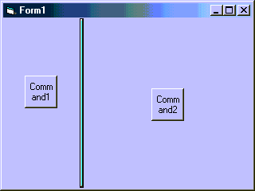



## Ultralite Splitter

### Description

This is a very small piece of code that produces a farely effective pane splitter. It is also a useful demonstracion of the SetCapture, ReleaseCapture events, and capturing mouse movement beyond the edge of an object.
 
### More Info
 

             |
---                |---
**Submitted On**   |2004-08-17 13:13:04
**By**             |[Bruce Fast](https://github.com/Planet-Source-Code/PSCIndex/blob/master/ByAuthor/bruce-fast.md)
**Level**          |Beginner
**User Rating**    |5.0 (25 globes from 5 users)
**Compatibility**  |VB 5\.0, VB 6\.0
**Category**       |[VB function enhancement](https://github.com/Planet-Source-Code/PSCIndex/blob/master/ByCategory/vb-function-enhancement__1-25.md)
**World**          |[Visual Basic](https://github.com/Planet-Source-Code/PSCIndex/blob/master/ByWorld/visual-basic.md)
**Archive File**   |[Ultralite\_1782968172004\.zip](https://github.com/Planet-Source-Code/bruce-fast-ultralite-splitter__1-55642/archive/master.zip)

### API Declarations

SetCapture, ReleaseCapture. See source for implementation.

